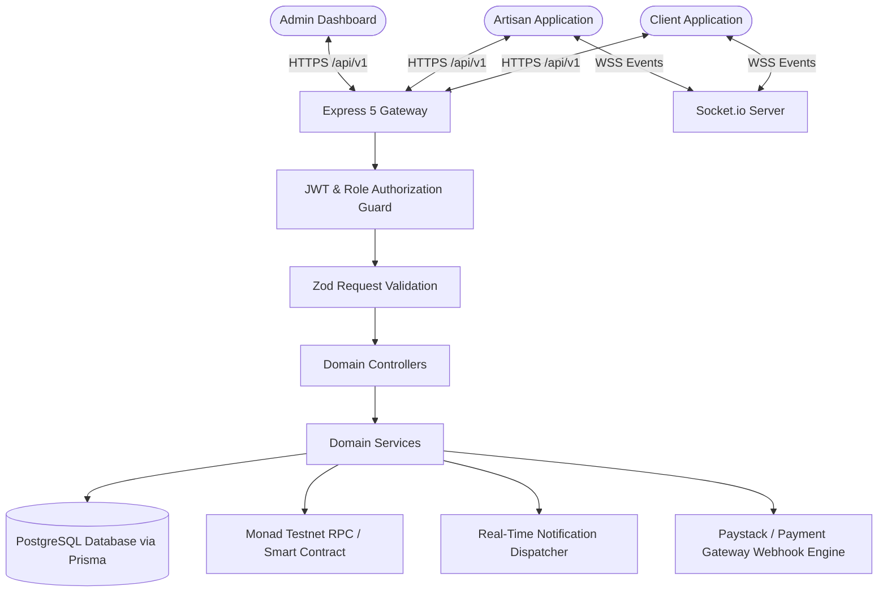

# Artisan Escrow Marketplace — Master API Documentation

> **Version:** `v1.1.0` (Comprehensive REST + WebSockets + Monad Web3)  
> **Base URL:** `http://localhost:5050/api/v1`  
> **Protocol:** RESTful HTTPS & WebSockets (Socket.io)  
> **Blockchain Integration:** Monad Testnet (EVM Chain ID `10143`)  
> **Database:** PostgreSQL (via Prisma ORM)  
> **Authentication:** JWT Bearer Access Tokens + Refresh Token Rotation + Role-Based Access Control (RBAC)  

---

## Table of Contents

1. [Architectural Overview](#1-architectural-overview)
2. [Authentication & Authorization (RBAC)](#2-authentication--authorization-rbac)
3. [Standard Request & Response Envelopes](#3-standard-request--response-envelopes)
4. [HTTP Methods & Idempotency Guide](#4-http-methods--idempotency-guide)
5. [Real-time WebSockets Gateway](#5-real-time-websockets-gateway)
6. [Hybrid Escrow Protocol (Web2 + Monad Web3)](#6-hybrid-escrow-protocol-web2--monad-web3)
7. [API Endpoints Reference](#7-api-endpoints-reference)
   - [7.1 System & Health (`/health`)](#71-system--health-health)
   - [7.2 Authentication & Sessions (`/auth`)](#72-authentication--sessions-auth)
   - [7.3 Profiles, Services & KYC (`/profiles`)](#73-profiles-services--kyc-profiles)
   - [7.4 Jobs & Invitations (`/jobs`)](#74-jobs--invitations-jobs)
   - [7.5 Proposals & Bidding (`/proposals`)](#75-proposals--bidding-proposals)
   - [7.6 Contracts & Work Agreements (`/contracts`)](#76-contracts--work-agreements-contracts)
   - [7.7 Escrow Protocol & Revisions (`/escrow`)](#77-escrow-protocol--revisions-escrow)
   - [7.8 Wallets, Bank Accounts & Cards (`/wallets`)](#78-wallets-bank-accounts--cards-wallets)
   - [7.9 Payments & Webhooks (`/payments`)](#79-payments--webhooks-payments)
   - [7.10 Disputes & Collaboration (`/disputes`)](#710-disputes--collaboration-disputes)
   - [7.11 Reviews & Reputation (`/reviews`)](#711-reviews--reputation-reviews)
   - [7.12 Real-Time Chat & Messaging (`/chat`)](#712-real-time-chat--messaging-chat)
   - [7.13 In-App Notifications (`/notifications`)](#713-in-app-notifications-notifications)
   - [7.14 Admin Management & Configuration (`/admin`)](#714-admin-management--configuration-admin)
8. [Automated Verification & Test Execution](#8-automated-verification--test-execution)

---

## 1. Architectural Overview

The **Artisan Escrow Marketplace** provides an enterprise decentralized architecture that bridges fiat transactions with on-chain EVM smart contracts.



---

## 2. Authentication & Authorization (RBAC)

### 2.1 JSON Web Tokens (JWT)
All protected endpoints require an `Authorization` header with a Bearer token:
```http
Authorization: Bearer <ACCESS_TOKEN>
```

- **Access Token:** Short-lived (15 minutes), containing `{ userId, email, role }`.
- **Refresh Token:** Long-lived (7 days), stored in the database with device tracking and IP logging.

### 2.2 Roles Matrix
| Role | Identifier | Permissions & Capabilities |
| :--- | :--- | :--- |
| **Client** | `CLIENT` | Post/manage jobs, invite artisans, accept bids, fund escrow, approve deliverables, rate artisans |
| **Artisan** | `ARTISAN` | Manage profile/portfolio/services, submit proposals, submit milestone proof, request payouts |
| **Admin** | `ADMIN` | Manage categories & skills, arbitrate disputes, review KYC, user suspension, system settings |
| **Support** | `SUPPORT` | Customer assistance, review KYC verifications, view disputes |

---

## 3. Standard Request & Response Envelopes

### 3.1 Success Envelope (`ApiResponse`)
```json
{
  "statusCode": 200,
  "data": { ... },
  "message": "Resource operation completed successfully",
  "success": true
}
```

### 3.2 Error Envelope (`ApiError`)
```json
{
  "statusCode": 400,
  "message": "Validation Error",
  "success": false,
  "errors": [
    { "field": "budgetMin", "message": "Minimum budget must be greater than 0" }
  ]
}
```

---

## 4. HTTP Methods & Idempotency Guide

- **`GET`**: Safe, idempotent read operations.
- **`POST`**: Non-idempotent entity creation or state transitions (e.g. login, funding).
- **`PUT`**: Idempotent full/complete resource update or replacement.
- **`PATCH`**: Idempotent partial resource update, status toggle, or field amendment.
- **`DELETE`**: Idempotent resource removal, cancellation, or soft-deactivation.

---

## 5. Real-time WebSockets Gateway

Real-time chat messaging, typing indicators, and user push alerts run over **Socket.io**.

- **Endpoint:** `ws://localhost:5050`
- **Handshake Authentication:** Token passed in `auth.token` or `headers.authorization`.

### Event Reference
| Event Name | Direction | Payload | Description |
| :--- | :--- | :--- | :--- |
| `join_conversation` | Client → Server | `conversationId` | Joins a conversation room |
| `leave_conversation` | Client → Server | `conversationId` | Leaves a conversation room |
| `send_message` | Client → Server | `{ conversationId, body, messageType, attachmentUrl }` | Sends chat message |
| `new_message` | Server → Client | Message object with sender | Broadcast to conversation room |
| `typing_start` / `stop` | Client → Server | `{ conversationId }` | Toggles typing status |
| `user_typing` / `stop` | Server → Client | `{ userId, conversationId }` | Broadcast to room |
| `notification` | Server → Client | Notification object | Emitted to personal `user:<userId>` room |

---

## 6. Hybrid Escrow Protocol (Web2 + Monad Web3)

1. **Web2 Mode (In-App Atomic Wallet):** Funds are locked in `escrowLockedBalance` and transferred on approval.
2. **Web3 Mode (Monad Smart Contract):** Client deposits `MON` directly into `ArtisanEscrow.sol` contract (Chain ID: `10143`). Backend verifies on-chain event and synchronizes database state.

---

## 7. API Endpoints Reference

---

### 7.1 System & Health (`/health`)

#### `GET /api/v1/health`
- **Auth:** Public
- **Description:** Uptime and service status check.

---

### 7.2 Authentication & Sessions (`/auth`)

#### `POST /api/v1/auth/register`
- **Auth:** Public
- **Description:** Registers new User, Profile, and digital Wallet.

#### `POST /api/v1/auth/login`
- **Auth:** Public
- **Description:** Authenticates user credentials and returns JWT token pair.

#### `POST /api/v1/auth/refresh-token`
- **Auth:** Public
- **Description:** Rotates and issues new access token.

#### `POST /api/v1/auth/logout`
- **Auth:** Public
- **Description:** Revokes current refresh token.

#### `POST /api/v1/auth/verify-otp`
- **Auth:** Public
- **Description:** Verifies 6-digit OTP code (`PHONE_VERIFICATION`, `PASSWORD_RESET`, `WITHDRAWAL_2FA`).

#### `GET /api/v1/auth/me`
- **Auth:** Bearer Token
- **Description:** Fetches current user profile and role details.

#### `PATCH /api/v1/auth/change-password` & `PUT /api/v1/auth/change-password`
- **Auth:** Bearer Token
- **Request Body:** `{ "oldPassword": "...", "newPassword": "..." }`
- **Description:** Updates password and invalidates all existing sessions.

#### `POST /api/v1/auth/forgot-password`
- **Auth:** Public
- **Request Body:** `{ "identifier": "email@example.com" }`
- **Description:** Generates `PASSWORD_RESET` OTP.

#### `POST /api/v1/auth/reset-password`
- **Auth:** Public
- **Request Body:** `{ "identifier": "...", "otp": "123456", "newPassword": "..." }`
- **Description:** Verifies OTP and resets account password.

#### `GET /api/v1/auth/sessions`
- **Auth:** Bearer Token
- **Description:** Lists all active login sessions and device user-agents.

#### `DELETE /api/v1/auth/sessions/:id`
- **Auth:** Bearer Token
- **Description:** Remotely revokes a specific device session.

#### `DELETE /api/v1/auth/sessions`
- **Auth:** Bearer Token
- **Description:** Revokes all other sessions except current.

---

### 7.3 Profiles, Services & KYC (`/profiles`)

#### `GET /api/v1/profiles/artisans`
- **Auth:** Public
- **Query Params:** `search`, `state`, `lgaCity`, `skillId`, `categoryId`, `page`, `limit`
- **Description:** Search and filter verified artisan directory.

#### `GET /api/v1/profiles/artisans/:id`
- **Auth:** Public
- **Description:** Detailed artisan profile with skills, portfolio, and services.

#### `PATCH /api/v1/profiles/client` & `PUT /api/v1/profiles/client`
- **Auth:** `CLIENT`
- **Description:** Updates client name, company, and location.

#### `PATCH /api/v1/profiles/artisan` & `PUT /api/v1/profiles/artisan`
- **Auth:** `ARTISAN`
- **Description:** Updates business name, bio, rates, and skills.

#### `PATCH /api/v1/profiles/artisan/availability`
- **Auth:** `ARTISAN`
- **Request Body:** `{ "isAvailable": true }`
- **Description:** Quick online/offline toggle.

#### `PATCH /api/v1/profiles/artisan/location`
- **Auth:** `ARTISAN`
- **Request Body:** `{ "latitude": 6.5244, "longitude": 3.3792 }`
- **Description:** Real-time GPS location update.

#### `POST /api/v1/profiles/artisan/portfolio`
- **Auth:** `ARTISAN`
- **Description:** Add project to portfolio showcase.

#### `PUT /api/v1/profiles/artisan/portfolio/:id` & `PATCH /api/v1/profiles/artisan/portfolio/:id`
- **Auth:** `ARTISAN`
- **Description:** Update portfolio project details.

#### `DELETE /api/v1/profiles/artisan/portfolio/:id`
- **Auth:** `ARTISAN`
- **Description:** Remove portfolio project.

#### `POST /api/v1/profiles/artisan/services`
- **Auth:** `ARTISAN`
- **Request Body:** `{ "title": "Full AC Servicing", "description": "...", "price": 25000, "deliveryDays": 1 }`
- **Description:** Add packaged service catalog offering.

#### `PUT /api/v1/profiles/artisan/services/:id` & `PATCH /api/v1/profiles/artisan/services/:id`
- **Auth:** `ARTISAN`
- **Description:** Update packaged service pricing or terms.

#### `DELETE /api/v1/profiles/artisan/services/:id`
- **Auth:** `ARTISAN`
- **Description:** Delete service catalog item.

#### `POST /api/v1/profiles/artisans/:id/save`
- **Auth:** `CLIENT`
- **Description:** Bookmark artisan profile.

#### `DELETE /api/v1/profiles/artisans/:id/save`
- **Auth:** `CLIENT`
- **Description:** Remove artisan bookmark.

#### `GET /api/v1/profiles/saved-artisans`
- **Auth:** `CLIENT`
- **Description:** List client's bookmarked artisans.

#### `PATCH /api/v1/profiles/wallet-address`
- **Auth:** Bearer Token
- **Description:** Bind Monad EVM wallet address (`0x...`).

#### `PATCH /api/v1/profiles/avatar`
- **Auth:** Bearer Token
- **Description:** Update profile picture.

#### `DELETE /api/v1/profiles/avatar`
- **Auth:** Bearer Token
- **Description:** Remove profile picture.

#### `DELETE /api/v1/profiles/account`
- **Auth:** Bearer Token
- **Description:** Soft-deactivate user account.

#### `POST /api/v1/profiles/kyc`
- **Auth:** Bearer Token
- **Description:** Submit ID document and selfie for KYC verification.

#### `PATCH /api/v1/profiles/kyc/:id/review`
- **Auth:** `ADMIN`, `SUPPORT`
- **Description:** Approve or reject KYC submission.

---

### 7.4 Jobs & Invitations (`/jobs`)

#### `GET /api/v1/jobs/categories`
- **Auth:** Public
- **Description:** Category hierarchy and associated skill tags.

#### `GET /api/v1/jobs`
- **Auth:** Public
- **Query Params:** `categoryId`, `state`, `lgaCity`, `status`, `minBudget`, `maxBudget`, `search`, `page`, `limit`

#### `GET /api/v1/jobs/:id`
- **Auth:** Public
- **Description:** Job details, required skills, attachments, and client info.

#### `GET /api/v1/jobs/my-jobs`
- **Auth:** `CLIENT`
- **Description:** List client's posted jobs.

#### `POST /api/v1/jobs`
- **Auth:** `CLIENT`
- **Description:** Post a new job opportunity.

#### `PUT /api/v1/jobs/:id` & `PATCH /api/v1/jobs/:id`
- **Auth:** `CLIENT`
- **Description:** Edit open job title, description, budget, or skills.

#### `PATCH /api/v1/jobs/:id/status`
- **Auth:** `CLIENT`
- **Description:** Update job status (e.g. `CANCELLED`, `COMPLETED`).

#### `DELETE /api/v1/jobs/:id`
- **Auth:** `CLIENT`
- **Description:** Delete/cancel job if no active contracts exist.

#### `DELETE /api/v1/jobs/:id/attachments/:attachmentId`
- **Auth:** `CLIENT`
- **Description:** Remove file attachment from job.

#### `POST /api/v1/jobs/:id/invite/:artisanId`
- **Auth:** `CLIENT`
- **Description:** Directly invite artisan to apply.

#### `GET /api/v1/jobs/invitations/my-invitations`
- **Auth:** `ARTISAN`
- **Description:** View job invitations received.

#### `PATCH /api/v1/jobs/invitations/:id/respond`
- **Auth:** `ARTISAN`
- **Request Body:** `{ "status": "ACCEPTED" }` (or `"DECLINED"`)

#### `DELETE /api/v1/jobs/invitations/:id`
- **Auth:** `CLIENT`
- **Description:** Cancel invitation sent to artisan.

#### `POST /api/v1/jobs/:id/save`
- **Auth:** `ARTISAN`
- **Description:** Bookmark job posting.

#### `DELETE /api/v1/jobs/:id/save`
- **Auth:** `ARTISAN`
- **Description:** Unsave job posting.

#### `GET /api/v1/jobs/saved`
- **Auth:** `ARTISAN`
- **Description:** List bookmarked jobs.

---

### 7.5 Proposals & Bidding (`/proposals`)

#### `POST /api/v1/proposals`
- **Auth:** `ARTISAN`
- **Description:** Submit competitive proposal with milestone schedule.

#### `GET /api/v1/proposals/my-proposals`
- **Auth:** `ARTISAN`
- **Description:** List artisan's submitted proposals.

#### `GET /api/v1/proposals/job/:jobId`
- **Auth:** `CLIENT`
- **Description:** View all bids on client's job.

#### `GET /api/v1/proposals/:id`
- **Auth:** Bearer Token
- **Description:** Fetch proposal detail by ID.

#### `PUT /api/v1/proposals/:id` & `PATCH /api/v1/proposals/:id`
- **Auth:** `ARTISAN`
- **Description:** Revise bid amount, cover letter, or milestones before acceptance.

#### `PATCH /api/v1/proposals/:id/status`
- **Auth:** `CLIENT`
- **Request Body:** `{ "status": "SHORTLISTED" }` (or `"REJECTED"`)

#### `DELETE /api/v1/proposals/:id`
- **Auth:** `ARTISAN`
- **Description:** Withdraw submitted proposal (`status: WITHDRAWN`).

---

### 7.6 Contracts & Work Agreements (`/contracts`)

#### `POST /api/v1/contracts/accept-proposal/:proposalId`
- **Auth:** `CLIENT`
- **Description:** Accepts bid, instantiates escrow contract, milestones, and chat channel.

#### `GET /api/v1/contracts`
- **Auth:** Bearer Token
- **Description:** List contracts for current user.

#### `GET /api/v1/contracts/:id`
- **Auth:** Bearer Token
- **Description:** Single contract details, milestones, disputes, reviews, and blockchain sync.

#### `PATCH /api/v1/contracts/:id/milestones/:milestoneId`
- **Auth:** `CLIENT`
- **Description:** Adjust milestone schedule before funding.

#### `DELETE /api/v1/contracts/:id/milestones/:milestoneId`
- **Auth:** `CLIENT`
- **Description:** Remove unfunded draft milestone.

#### `DELETE /api/v1/contracts/:id/cancel` & `PATCH /api/v1/contracts/:id/cancel`
- **Auth:** Bearer Token
- **Description:** Cancel unfunded contract in `PENDING_FUNDING` status.

---

### 7.7 Escrow Protocol & Revisions (`/escrow`)

#### `POST /api/v1/escrow/fund-milestone/:milestoneId`
- **Auth:** `CLIENT`
- **Description:** Lock funds into escrow (supports Web3 Monad tx hash or In-App Wallet).

#### `POST /api/v1/escrow/submit-work/:milestoneId`
- **Auth:** `ARTISAN`
- **Description:** Submit deliverable proof with before/after photos.

#### `PATCH /api/v1/escrow/request-revision/:milestoneId`
- **Auth:** `CLIENT`
- **Request Body:** `{ "revisionNotes": "Please add conduit protection..." }`
- **Description:** Request changes; reverts status from `SUBMITTED` to `IN_PROGRESS`.

#### `POST /api/v1/escrow/approve-release/:milestoneId`
- **Auth:** `CLIENT`
- **Description:** Approve work and release funds to artisan minus 5% platform fee.

#### `POST /api/v1/escrow/refund-milestone/:milestoneId` & `PATCH /api/v1/escrow/refund-milestone/:milestoneId`
- **Auth:** `ARTISAN`
- **Request Body:** `{ "refundReason": "Customer requested alternative installer" }`
- **Description:** Voluntary artisan refund of funded milestone back to client balance.

#### `POST /api/v1/escrow/sync-onchain/:contractId`
- **Auth:** Bearer Token
- **Description:** Reconciles Monad blockchain smart contract state with database.

---

### 7.8 Wallets, Bank Accounts & Cards (`/wallets`)

#### `GET /api/v1/wallets/my-wallet`
- **Auth:** Bearer Token
- **Description:** Available and locked balances + ledger transactions.

#### `POST /api/v1/wallets/simulate-deposit`
- **Auth:** Bearer Token
- **Request Body:** `{ "amount": 100000 }`
- **Description:** Development test fund top-up.

#### `POST /api/v1/wallets/bank-accounts`
- **Auth:** Bearer Token
- **Description:** Link verified bank account for withdrawals.

#### `GET /api/v1/wallets/bank-accounts`
- **Auth:** Bearer Token
- **Description:** List linked bank accounts.

#### `PATCH /api/v1/wallets/bank-accounts/:id/default`
- **Auth:** Bearer Token
- **Description:** Set account as default payout method.

#### `DELETE /api/v1/wallets/bank-accounts/:id`
- **Auth:** Bearer Token
- **Description:** Unlink bank account.

#### `POST /api/v1/wallets/withdraw`
- **Auth:** Bearer Token
- **Request Body:** `{ "bankAccountId": "...", "amount": 50000 }`
- **Description:** Request payout withdrawal to bank account.

#### `DELETE /api/v1/wallets/withdrawals/:id` & `PATCH /api/v1/wallets/withdrawals/:id/cancel`
- **Auth:** Bearer Token
- **Description:** Cancel pending withdrawal request and refund wallet.

#### `GET /api/v1/wallets/saved-cards`
- **Auth:** Bearer Token
- **Description:** List saved debit/credit cards.

#### `PATCH /api/v1/wallets/saved-cards/:id/default`
- **Auth:** Bearer Token
- **Description:** Set card as default payment method.

#### `DELETE /api/v1/wallets/saved-cards/:id`
- **Auth:** Bearer Token
- **Description:** Remove saved card token.

---

### 7.9 Payments & Webhooks (`/payments`)

#### `POST /api/v1/payments/webhook`
- **Auth:** HMAC SHA-512 Signature (`x-paystack-signature`)
- **Description:** Process automated payment provider webhooks.

---

### 7.10 Disputes & Collaboration (`/disputes`)

#### `POST /api/v1/disputes`
- **Auth:** Bearer Token
- **Description:** File dispute on contract/milestone and freeze escrow funds.

#### `GET /api/v1/disputes/contract/:contractId`
- **Auth:** Bearer Token
- **Description:** Fetch disputes for contract.

#### `GET /api/v1/disputes/:id/messages`
- **Auth:** Bearer Token
- **Description:** Message thread history within dispute.

#### `POST /api/v1/disputes/:id/messages`
- **Auth:** Bearer Token
- **Description:** Send message within dispute.

#### `POST /api/v1/disputes/:id/evidence`
- **Auth:** Bearer Token
- **Description:** Upload supplementary evidence to dispute.

#### `DELETE /api/v1/disputes/evidence/:evidenceId`
- **Auth:** Bearer Token
- **Description:** Delete uploaded evidence.

#### `PATCH /api/v1/disputes/:id/cancel` & `DELETE /api/v1/disputes/:id`
- **Auth:** Bearer Token
- **Description:** Withdraw/cancel dispute before admin ruling.

#### `PATCH /api/v1/disputes/:id/resolve`
- **Auth:** `ADMIN`, `SUPPORT`
- **Description:** Admin resolution (`FULL_REFUND_CLIENT`, `FULL_PAYOUT_ARTISAN`, `SPLIT_SETTLEMENT`, `CANCELLED`).

---

### 7.11 Reviews & Reputation (`/reviews`)

#### `POST /api/v1/reviews`
- **Auth:** Bearer Token
- **Description:** Submit review on completed contract.

#### `PUT /api/v1/reviews/:id` & `PATCH /api/v1/reviews/:id`
- **Auth:** Bearer Token
- **Description:** Edit review ratings or comment.

#### `POST /api/v1/reviews/:reviewId/reply` & `PATCH /api/v1/reviews/:reviewId/reply`
- **Auth:** `ARTISAN`
- **Description:** Post artisan response reply.

#### `DELETE /api/v1/reviews/:id`
- **Auth:** Bearer Token (Author or Admin)
- **Description:** Delete review and recalculate rating averages.

#### `GET /api/v1/reviews/artisan/:artisanUserId`
- **Auth:** Public
- **Description:** Public review listing for artisan.

---

### 7.12 Real-Time Chat & Messaging (`/chat`)

#### `GET /api/v1/chat/conversations`
- **Auth:** Bearer Token
- **Description:** List active user conversations.

#### `PATCH /api/v1/chat/conversations/:id/mute`
- **Auth:** Bearer Token
- **Description:** Mute/unmute conversation notifications.

#### `DELETE /api/v1/chat/conversations/:id`
- **Auth:** Bearer Token
- **Description:** Leave/archive conversation.

#### `GET /api/v1/chat/conversations/:conversationId/messages`
- **Auth:** Bearer Token
- **Description:** Message history with sender profile.

#### `POST /api/v1/chat/conversations/:conversationId/messages`
- **Auth:** Bearer Token
- **Description:** Send chat message via REST.

#### `PUT /api/v1/chat/messages/:messageId` & `PATCH /api/v1/chat/messages/:messageId`
- **Auth:** Bearer Token
- **Description:** Edit sent message body.

#### `DELETE /api/v1/chat/messages/:messageId`
- **Auth:** Bearer Token
- **Description:** Delete / unsend message.

---

### 7.13 In-App Notifications (`/notifications`)

#### `GET /api/v1/notifications`
- **Auth:** Bearer Token
- **Query Params:** `page`, `limit`, `unreadOnly`
- **Description:** Paginated notifications with unread counts.

#### `PATCH /api/v1/notifications/:id/read`
- **Auth:** Bearer Token
- **Description:** Mark single notification as read.

#### `PATCH /api/v1/notifications/read-all`
- **Auth:** Bearer Token
- **Description:** Mark all user notifications as read.

#### `DELETE /api/v1/notifications/:id`
- **Auth:** Bearer Token
- **Description:** Delete single notification.

#### `DELETE /api/v1/notifications`
- **Auth:** Bearer Token
- **Description:** Clear all read notifications.

---

### 7.14 Admin Management & Configuration (`/admin`)

*All `/admin` endpoints require `ADMIN` or `SUPPORT` role authorization.*

#### `POST /api/v1/admin/categories`
- **Auth:** `ADMIN`
- **Description:** Create job category.

#### `PUT /api/v1/admin/categories/:id` & `PATCH /api/v1/admin/categories/:id`
- **Auth:** `ADMIN`
- **Description:** Update category name, slug, parent, icon.

#### `DELETE /api/v1/admin/categories/:id`
- **Auth:** `ADMIN`
- **Description:** Deactivate category.

#### `POST /api/v1/admin/skills`
- **Auth:** `ADMIN`
- **Description:** Create skill under category.

#### `PUT /api/v1/admin/skills/:id` & `PATCH /api/v1/admin/skills/:id`
- **Auth:** `ADMIN`
- **Description:** Rename/update skill.

#### `DELETE /api/v1/admin/skills/:id`
- **Auth:** `ADMIN`
- **Description:** Delete skill.

#### `PATCH /api/v1/admin/users/:id/status`
- **Auth:** `ADMIN`
- **Request Body:** `{ "status": "SUSPENDED", "reason": "Terms of service violation" }`
- **Description:** Suspend, reactivate, or ban user account with audit trail.

#### `GET /api/v1/admin/audit-logs`
- **Auth:** `ADMIN`
- **Query Params:** `action`, `entityType`, `page`, `limit`
- **Description:** Query immutable system audit logs.

#### `GET /api/v1/admin/settings`
- **Auth:** `ADMIN`
- **Description:** List platform configuration variables.

#### `PUT /api/v1/admin/settings/:key` & `PATCH /api/v1/admin/settings/:key`
- **Auth:** `ADMIN`
- **Request Body:** `{ "value": "5.00", "description": "Platform fee" }`
- **Description:** Update platform system settings.

---

## 8. Automated Verification & Test Execution

Run the complete 41-step end-to-end integration test runner:
```bash
node scripts/test-all-endpoints.js
```

Run the complete marketplace demonstration flow:
```bash
npm run demo
```

Deploy and test Monad Blockchain smart contracts:
```bash
npm run compile
npm run deploy:escrow
npm run test:monad
```
